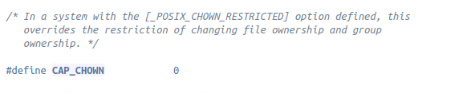

# capability的数据结构
## 1.进程确定使用哪种capability的数据结构（64位位图)
https://blog.csdn.net/wangpengqi/article/details/9821227
这篇文章里面说明了Linux实现capability的机制
>2)capability可以作用在进程上(受限),也可以作用在程序文件上,它与sudo不同,sudo只针对用户/程序/文件的概述,即sudo可以配置某个用户可以执行某个命令,可以更改某个文件,而capability是让某个程序拥有某种能力,例如:

这句话说明了这里的sudo应该和privileged基本一致，说明了capability的理念。
>3)每个进程有三个和能力有关的位图:inheritable(I),permitted(P)和effective(E),对应进程描述符task_struct(include/linux/sched.h)里面的cap_effective, cap_inheritable, cap_permitted,所以我们可以查看/proc/PID/status来查看进程的能力.

**上面的内容说明了三个进程描述符在kernel中的位置**

>4)cap_effective:当一个进程要进行某个特权操作时,操作系统会检查cap_effective的对应位是否有效,而不再是检查进程的有效UID是否为0.
例如,如果一个进程要设置系统的时钟,Linux的内核就会检查cap_effective的CAP_SYS_TIME位(第25位)是否有效.

>5)cap_permitted:表示进程能够使用的能力,在cap_permitted中可以包含cap_effective中没有的能力，这些能力是被进程自己临时放弃的,也可以说cap_effective是cap_permitted的一个子集.

>6)cap_inheritable:表示能够被当前进程执行的程序继承的能力.

这个能力比较重要，也就是如果我为一个进程增加了capability，他的所有子进程都有了这个capability。
这两条说明了capability是一个与进程相关的变量，通过检查相应二进制位来实现。
我对cap_effective和cap_permitted的区别弄得还不是太清楚。

>8)不能单独设定CAP_EFFECTIVE,CAP_INHERITABLE位图,必须要和CAP_PERMITTED联用,且CAP_PERMITTED一定要是其它两个位图的超集.

这句话可能在将来实现的时候会用到。
上面这篇文章是针对kenel2.6说明的，在v5.0中，*/include/linux/cred.h*中的*struct sched*中有
>kernel_cap_t	cap_inheritable; /* caps our children can inherit */

>kernel_cap_t	cap_permitted;	/* caps we're permitted */

>kernel_cap_t	cap_effective;	/* caps we can actually use */

我还发现了(在/include/linux/cred.h中)有另一个类似定义
>typedef struct __user_cap_data_struct {

>        __u32 effective;
>        __u32 permitted;
>       __u32 inheritable;
>} __user *cap_user_data_t;
这一个_user_cap_data_struct应该是指某种进程，最多不超过32中capability。
至于kernel_cap_t的定义（在/include/linux/capability.h）：
>typedef struct kernel_cap_struct {

>	__u32 cap[_KERNEL_CAPABILITY_U32S];

>} kernel_cap_t;

对_KERNEL_CAPABILITY_U32S的循环定义，都在（/include/linux/capability.h）中：
*#define  _KERNEL_CAPABILITY_U32S             _LINUX_CAPABILITY_U32S_3*
*#define _LINUX_CAPABILITY_U32S_3     2*

从中可以看出kenel_cap_struct实际上是一个有两个u32元素的数组，一个u32是32个bit，应该是由于一个u32无法表示38个capability，所以用了两个u32，可以理解为cap_effective和cap_permitted，以及cap_inheritable是表示38个capability的位图，bitmap。
下一步应该研究一下这个struct_task和struct cred之间的关系
## 2.task_struct与cred之间的关系
在task_struct中存在三个有关cred的组成部分，\*real_cred,\*ptracer_cred,\*cred,这三个组成部分。
**明天开始调查task_struct是如何影响这个标志位的**
**调研capability的数据结构，就是SYS_nice这种数据结构**

https://elixir.bootlin.com/linux/latest/source/include/uapi/linux/capability.h
源码中的内容证明了capability是有38项，第一项0，第38项标号37。
如果只是增加cap_SYS_nice的话，直接找到相应位图修改的位置，与cap_SYS_NICE做或即可。

这个里面eip表示effective、inheritable、permitted,表示在三个位图都有，每个如果是+eip，表示每个capability都是符合effective、inheritable、permitte的。