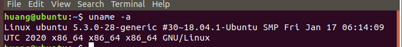
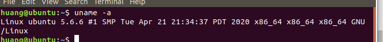
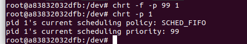

# commoncap.c 
## 1. 对capability修改的思路以及sys_nice的位置

https://elixir.bootlin.com/linux/v5.7-rc1/source/security/commoncap.c

各个capability实现都在这个security/commoncap.c中
这个图里面提到
> Detemine if requested scheduler poicy change is permitted for the specified task, returing 0 if permission is granted, -ve if denied.

所以第一步，直接把这个返回值改成0，全部允许试试看
## 2. 编译内核的方法
我是通过这个方法对Linux内核进行编译的
https://blog.csdn.net/qq_36290650/article/details/83052315
时间较长，但是最后成功，注意中间有一段报错是因为终端没有全屏，全屏之后就好了。
这是修改之前的内核

，这是修改之后的内核，经过博客上那一顿操作之后的内核

这是在这个内核上的非特权容器进行操作（dev文件夹说明了这是一个非特权容器）

这是在非特权容器上利用chrt进行调度策略调整

调整成功，这说明了，我的那个思路是正确的，应该去研究这个commoncap.c