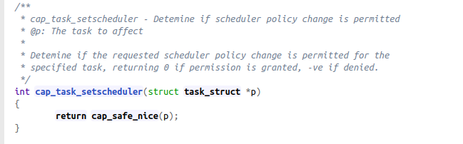

# commoncap.c 
## 1. 对capability修改的思路以及sys_nice的位置

https://elixir.bootlin.com/linux/v5.7-rc1/source/security/commoncap.c

各个capability实现都在这个security/commoncap.c中
这个图里面提到
> Detemine if requested scheduler poicy change is permitted for the specified task, returing 0 if permission is granted, -ve if denied.

所以第一步，直接把这个返回值改成0，全部允许试试看
## 2. 编译内核的方法
https://blog.csdn.net/qq_36290650/article/details/83052315
我是按照这篇博客来进行调试的，第一步，进行了把上述图中的那个函数，修改成为了 return 0;编译时间有点长
