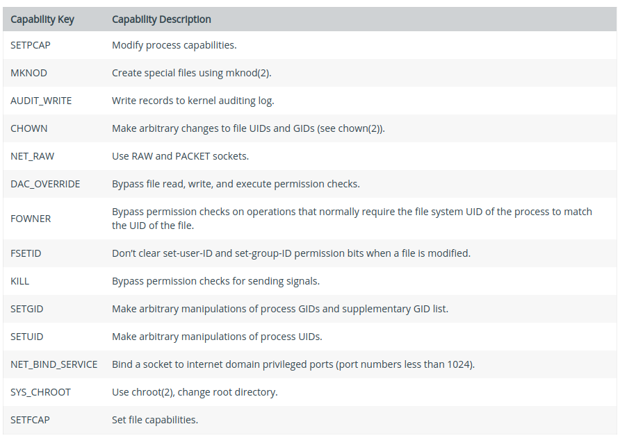
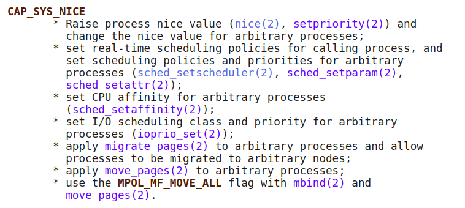
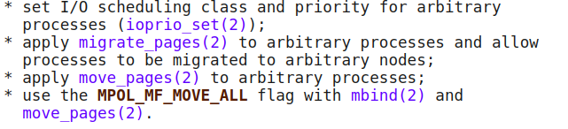
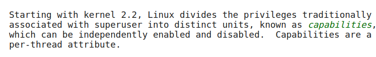

# 容器中的capability机制(2020.4.17)
## 1.capability的概念以及特权与非特权容器的capability问题
https://ericchiang.github.io/post/privileged-containers/

这篇文章提到了
> What makes a privileged container truly dangerous are the Linux capabilities granted to it. Capabilities are the set of powers that compose “root” such as listening on lower ports, killing other processes, or changing file ownership. 

这篇文章主要论述了为什么“privileged container is not a container"，首先说明了privileged container可以访问所有文件，然后说明了privileged container 有所有capability，此处存疑。从docker文档中查阅
https://docs.docker.com/engine/reference/commandline/run/
  docker用户文档中提到
  >The --privileged flag gives all capabilities to the container, and it also lifts all the limitations enforced by the device cgroup controller. In other words, the container can then do almost everything that the host can do. This flag exists to allow special use-cases, like running Docker within Docker.

  privileged container 有所有capability，没有什么疑问了，特权容器就是拥有所有capability，
  https://docs.docker.com/engine/reference/run/#runtime-privilege-and-linux-capabilities
docker用户文档说明了非特权容器具有的capability，下图表示了非特权容器具有的capability列表，共14项，

特权容器多出来的，可以被added的，共有23项，也就是特权容器有37项capability，都在上面链接里面。Linux总共有38项capability，为什么只给了特权容器37项，这是一个问题，留待以后解答，当前先解决一下SYS_NICE的问题。
## 2.Linux内核中的capability及其相应功能
http://man7.org/linux/man-pages/man7/capabilities.7.html
>Starting with kernel 2.2, Linux divides the privileges traditionally associated with superuser into distinct units, known as capabilities, which can be independently enabled and disabled.Capabilities are a per-thread attribute.

里面列举了38项capability以及相关的作用。
SYS_NICE的相关描述：

里面提到了”set real-time schedulint policies " 和“set cpu affinity"，从中可以看出，*chrt*和*taskset*都需要这个capability。

**下一步工作的重点应该是放在如何把这三个不需要的功能去掉，即进一步细化SYS_NICE，形成不需要这三个的新的capability。**
>For the purpose of performing permission checks, traditional UNIX
       implementations distinguish two categories of processes: privileged
       processes (whose effective user ID is 0, referred to as superuser or
       root), and unprivileged processes (whose effective UID is nonzero).
       Privileged processes bypass all kernel permission checks, while
       unprivileged processes are subject to full permission checking based
       on the process's credentials (usually: effective UID, effective GID,
       and supplementary group list).

不知道这种传统模式下的采用的privileged process和unprivileged process对容器有无参考价值。我感觉这个privileged process非常像这个privileged container的情况，跳过所有内核检查，而unprivieged process像是“unprivileged container”，需要进行检查。**后来privileged process和unprivileged process都修改成为了下面所说的，所以我觉得比较理想的unprivileged container也应该是下面这种思路，细化capability。**
，当前Linux应该是不采用传统模式了。
**明天应该对capability的机制进行了解，即他的数据结构是什么，是通过cgroup还是namespace进行操作的，然后细化到SYS_NICE，对其进行操作。**