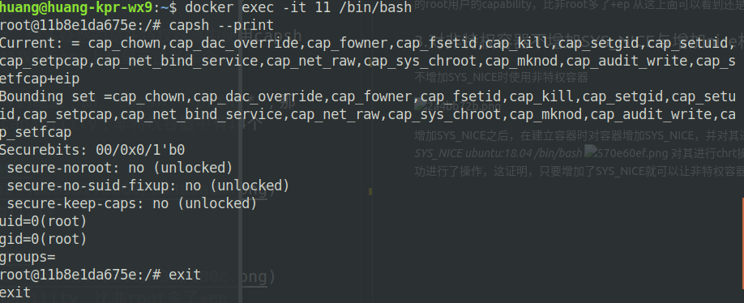
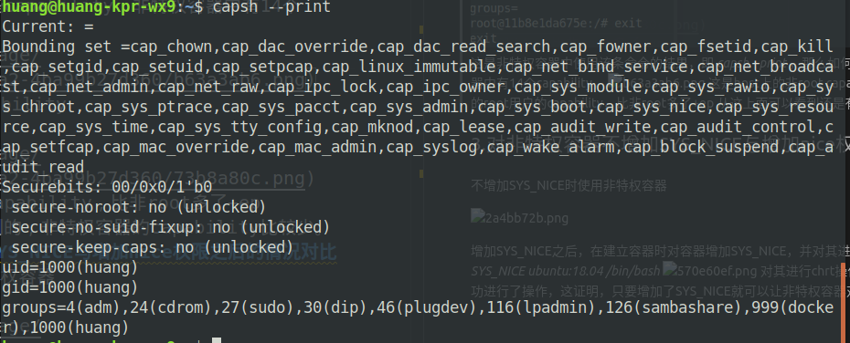
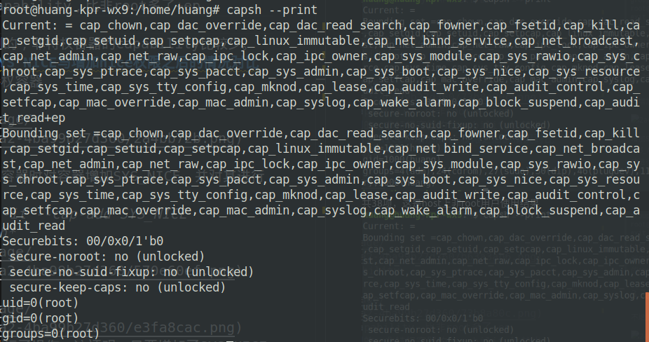
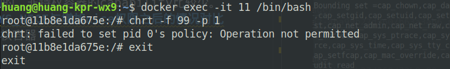
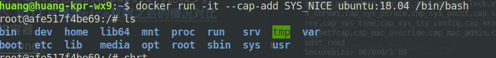

# 容器中进行使用chrt调度所需要使用的capability
## 1. 研究思路
   下面这篇文章提到了
   https://github.com/moby/moby/issues/25622
> So far I have tested changing the scheduling policy and thread priority with a C program and chrt. This requires the SYS_NICE capability.
> 
其中指出了chrt需要使用SYS_NICE，下面应该具体了解一下SYS_NICE这种capability，了解一下是否可以直接在docker容器中增加这种能力，这个修改起来应该很简单，
> The same calls work fine when I bypass user namespace with --userns host and add the required capabilities with --cap-add.
> 
这里面提到的cap-add应该直接可以使用，下面，我先试试，直接使用cap-add增加上SYS_NICE这种能力能否实现。
&ensp;&ensp;&ensp;&ensp;然后调研一下capablity，看一下他的实现原理，尤其是SYS_NICE是干什么的，然后可以使用一些小技巧，具体来说就是调用docker直接加上这种能力来实现，但是这种方法感觉是不太行的，因为你增加了这种capability肯定使容器的安全性下降，关键是调研一下SYS_NICE除了调度上可以使用，有没有其他用途，会不会引起增加其他权限。
## 2.对docker如何使用cap-add进行调研
新建了一个特权容器，使用 *docker run -it --privileged ubuntu:18.04 /bin/bash*
container id 是 **f54**。令人疑惑的是在特权容器中使用capsh显示没有这个命令，但是在非特权和host上都显示这条命令。

这是非特权容器中使用该条命令的结果，即 *capsh --print* ，那么如何查看特权容器中有哪些capability，非特权容器中有14个capability，

共38项，这是host上非root用户使用结果

这是host上的root用户的capability，比非root多了+ep

从这上面可以看到还是有区别的，非特权容器的capability比较少。
## 3.对非特权容器不增加SYS_NICE与增加nice权限之后的情况对比
不增加SYS_NICE时使用非特权容器

增加SYS_NICE之后，在建立容器时对容器增加SYS_NICE，并对其进行操作
增加的代码 *docker run -it --cap-add SYS_NICE ubuntu:18.04 /bin/bash*

对其进行chrt操作

从图中可以看到，对其成功进行了操作，这证明，只要增加了SYS_NICE就可以让非特权容器对其调度方法进行调整

## conclusion
今天从这篇文章里面找到了使用vscode中的方法，终于找到了一个处理截图的方法了，一会修改一样vs的主题
https://blog.csdn.net/qq_41961459/article/details/103900701 ，
这个方法一石二鸟，也解决了我上传github的问题了